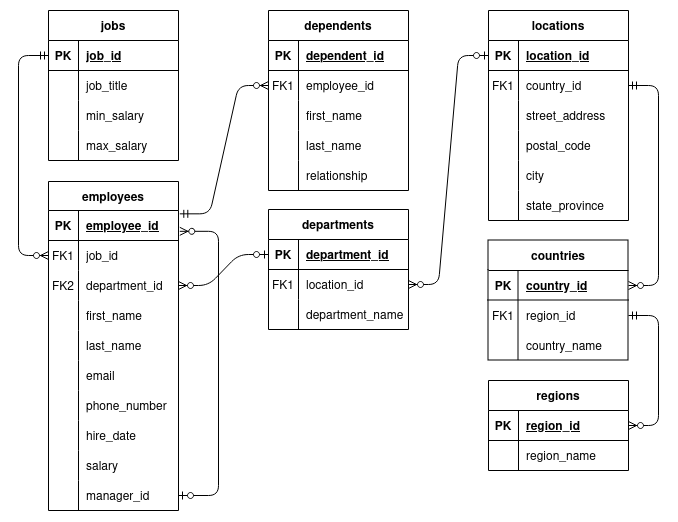

# SQL Sample Database

Practice for my SQL course.

## Description

[SQL tutorial](https://www.sqltutorial.org) Sample Database called HR that manages the HR data of small businesses.

The following diagram shows the initial DB design:

